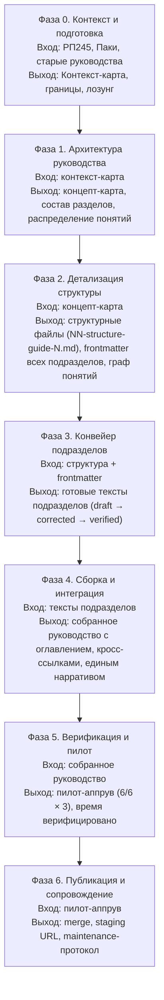

# Фазы написания универсального руководства v4

> **Назначение:** высокоуровневый план производства одного руководства (Guide 1–4) от замысла до публикации.  
> **Отличие от WRITING-PIPELINE.md:** тот документ описывает **этапы одного подраздела** (E1–E14). Этот документ описывает **фазы всего руководства** — от архитектуры до сопровождения. Каждая фаза может порождать десятки проходов по E1–E14.

---

## Общая схема



---

## Фаза 0. Контекст и подготовка

**Entry condition:** утверждён РП245 (Программа ЛР) и выбрано руководство для написания.  
**Время:** 2–4 часа.  
**Выход:** контекст-карта + документ границ.

### 0.1. Сбор входных данных

| Что | Где | Что проверить |
|-----|-----|---------------|
| Программа ЛР (нарратив, дуга, узлы) | `DS-my-strategy/inbox/WP-245-*` | Какое место руководство занимает в дуге «мем → метод → мировоззрение» |
| Текущие (старые) руководства | `aisystant/docs/docs/ru/personal-design/` | Что заменяется, что сохраняется, что мигрирует |
| Паки (онтология, FORM, METHOD, CAT) | `PACK-personal/pack/personal-development/` | Какие понятия уже формализованы, какие — кандидаты |
| Ролевая траектория | `.claude/rules/role-prefixes.md` | Какие роли и ступени охватывает руководство |
| FPF / SPF / ZP | `SPF/ontology.md`, `DS-Knowledge-Index-Tseren/docs/SPF/ontology.md` | Родители `U.*` для доменных понятий |
| Реестр понятий v4 | `07-concept-candidates-v4.md` | Какие понятия уже выявлены для этого руководства |
| Mapping старого → новое | `05-mapping-old-to-new.md` | Соответствие старых разделов новым |

### 0.2. Определение границ руководства

**Четырёхгранник границ:**

1. **Что входит:** какие темы, методы, понятия.
2. **Что не входит:** что остаётся в других руководствах (cross-guide boundaries).
3. **Ступенной диапазон:** `stage_range` (например, `[2, 5]` для Guide 3).
4. **Узел мастерства:** какой из трёх узлов (мыслительное / саморазвитие / iwe) — доминирующий.

**Артефакт:** документ границ в 5–10 предложений. Пример:
> Guide 3 описывает IWE как среду работы и развития. Не описывает методы (это Guide 2) и не вводит мировоззренческую дугу (это Guide 1). Актуально со ступени 2. Доминирующий узел: iwe.

### 0.3. Проверка Pack-sufficiency

**Блокирующее условие:** перед началом Фазы 1 проверить, что все понятия, которые **должны** войти в руководство, либо уже есть в `PACK-personal/ontology.md` §2 с `U.*` и Pack-источником, либо зафиксированы в `07-concept-candidates-v4.md` и назначены на формализацию.

Если нет — спринт по Pack, не архитектура. См. `00-requirements.md` §«Pack-sufficiency gate».

---

## Фаза 1. Архитектура руководства

**Entry condition:** Pack-sufficiency PASS + контекст-карта.  
**Время:** 4–6 часов.  
**Выход:** концепт-карта + структура разделов.

### 1.1. Концепт-карта

**Источник:** Pack (не старые руководства).  
**Содержание:**
- Лозунг руководства (1 предложение).
- Объект описания (что изучается).
- Ось мастерства (какое мастерство развивается).
- Основные идеи (10–12 тезисов из Pack).
- Основные понятия (15–30 шт.) с указанием: каноническое имя, родитель `U.*`, Pack-источник.
- Риски дублирования (что пересекается с другими руководствами и как развести).

**Формат:** `NN-concept-map-guide-N.md`. См. примеры: `03-concept-map-guide-3.md`.

### 1.2. Структура разделов

**Принцип:** каждый раздел = тематическая неделя (~7 содержательных подразделов + 4 служебных).

**Алгоритм:**
1. Распределить понятия по разделам (1 раздел ≈ 3–5 понятий).
2. Упорядочить разделы по нарративной дуге.
3. Проверить: каждый раздел имеет `mastery_node` и `stage_relevant`.
4. Зафиксировать `section_id` (PD.GUIDE.N.S1 … S10).

**Артефакт:** список разделов с названиями, логикой порядка и назначенными понятиями.

---

## Фаза 2. Детализация структуры

**Entry condition:** концепт-карта утверждена.  
**Время:** 6–10 часов.  
**Выход:** `NN-structure-guide-N.md` + `v4-concept-graph.yaml` (или лёгкий вариант frontmatter).

### 2.1. Подразделы

Каждый раздел детализируется до подразделов:

| Подраздел | Назначение | Количество |
|-----------|-----------|------------|
| SS1–SS7 | Содержательные (по 1 на день) | 7 |
| SS8 | Список понятий раздела | 1 |
| SS9 | Упражнения на понятия | 1 |
| SS10 | Вопросы для повторения | 1 |
| SS11 | Выводы раздела | 1 |

**Правила:**
- Плотность: 1–3 понятия на SS1–SS7.
- Каждый подраздел получает `subsection_id`, `title`, `order`.
- Каждый подраздел получает frontmatter: `mastery_node`, `stage_relevant`, `introduces`, `uses`, `prerequisites`, `can_do`, `cp_check`, `bh_check`, `bottleneck_hint`.

### 2.2. Граф понятий

**Производный артефакт:** расположение понятий по подразделам создаёт граф.  
**Правило:** понятие `вводится` только в одном подразделе (принцип единого определения).  
**Инструмент:** `v4-lint.py structure` — проверяет отсутствие orphan-ссылок, омонимов, превышения лимита `introduces`.

```bash
python3 tools/v4-lint.py structure specs/v4-reference/03-structure-guide-3.md
```

### 2.3. Технический gate

**Что проверяется:**
- [ ] Парсер не обрезает понятия.
- [ ] Численная сортировка разделов корректна (S1, S2, … S10).
- [ ] Нет пропусков SS (или явно помечены `optional: true`).
- [ ] Омонимы разрешены квалификатором.

**Exit condition:** `v4-lint structure` → exit 0.

---

## Фаза 3. Конвейер подразделов

**Entry condition:** структура PASS + frontmatter всех подразделов заполнены.  
**Время:** 20–60 часов (зависит от количества подразделов и параллелизма).  
**Выход:** готовые тексты всех содержательных подразделов (SS1–SS7 каждого раздела).

### 3.1. Принцип массового производства

Каждый подраздел проходит через конвейер E1–E14 из `WRITING-PIPELINE.md`:

| Этап | Что происходит | Кто |
|------|---------------|-----|
| E1 | Контекст и входные данные | Автор |
| E2 | Технический gate | Автор + `v4-lint` |
| E3 | Структура подраздела (frontmatter) | Автор |
| E4 | Промпт написания | Автор (или агент по промпту) |
| E5 | Самопроверка | Автор |
| E6 | Платформенная сверка | `v4-lint pack-drift` |
| E7 | FPF + нарратив (автоматическая часть) | `v4-lint structure/porter` |
| E8 | Porter-readiness | `v4-lint porter` |
| E9 | Субагент-ревью | Внешний рецензент |
| E10 | Кросс-руководственная согласованность | `v4-lint cross-guide` |
| E11 | Верификация времени | Автор (чтение вслух) |
| E12 | Пилот-тест | 3 внешних пилота |
| E13 | Фиксация и доставка | Автор (commit) |
| E14 | Протокол сопровождения | Pack-watcher |

**Параллельность:** подразделы одного раздела можно писать последовательно (они зависят друг от друга по `prerequisites`), подразделы разных разделов — параллельно.

### 3.2. Приоритизация

**Рекомендуемый порядок:**
1. Пилотный подраздел (первый SS1 первого раздела) — через весь E1–E12 для проверки тональности.
2. Первый раздел целиком (SS1–SS7) — для проверки нарративной целостности.
3. Остальные разделы — пакетами по 2–3 раздела.
4. Служебные подразделы (SS8–SS11) — после завершения всех SS1–SS7 своего раздела.

### 3.3. Gate на входе в Фазу 4

- [ ] Все SS1–SS7 написаны.
- [ ] Все E5 (самопроверка) пройдены.
- [ ] Все E6–E8 (автоматизированные gate'ы) — PASS.
- [ ] E9 (субагент) — PASS для пилотного подраздела и выборочно для остальных.

---

## Фаза 4. Сборка и интеграция

**Entry condition:** все содержательные подразделы написаны и прошли E5–E9.  
**Время:** 4–8 часов.  
**Выход:** собранное руководство с единым оглавлением и кросс-ссылками.

### 4.1. Сборка оглавления

- Генерация `README.md` руководства или `_index.md`.
- Нумерация: двузначная (`1.01`, `1.10`) для корректной сортировки.
- Правило: файлы размещаются только в подпапках разделов (`sN-section-name/`).

### 4.2. Кросс-ссылки

- **Внутри руководства:** каждый подраздел ссылается на введённые ранее понятия (`используется: ... — см. §X.YY`).
- **Между руководствами:** проверить, что понятия, введённые в других руководствах, помечены как `uses`, а не `introduces`.
- **Forward-references:** запрещены боевые ссылки на ещё не написанные руководства. Использовать пометки: «(будет в Руководстве 2)».

### 4.3. Нарративная целостность

**Проверка:** прослеживается ли дуга «мем → метод → мировоззрение» на уровне руководства (не только подраздела)?  
**Инструмент:** ручная проверка + субагент на уровне всего руководства (выборочно).

### 4.4. Чеклист сборки

- [ ] Оглавление корректно отсортировано (S1, S2, … S10; 1.01, 1.02, … 1.11).
- [ ] Все файлы в подпапках разделов, не в корне.
- [ ] Кросс-ссылки работают (нет битых ссылок).
- [ ] Каждый подраздел открывается блоком «Время».
- [ ] В каждом SS1–SS7 есть блок «Что дальше».
- [ ] Нет дублирования определений: каждое понятие `вводится` ровно один раз.

---

## Фаза 5. Верификация и пилот

**Entry condition:** руководство собрано и структурно целостно.  
**Время:** 8–16 часов (включая время пилотов).  
**Выход:** пилот-аппрув + верифицированное время.

### 5.1. Верификация времени (E11 на уровне руководства)

Автор читает 3–5 подразделов вслух, выполняет практики. Если отклонение > 20% от нормы — корректировка.

| Руководство | Норма на подраздел | Допустимый диапазон |
|-------------|-------------------|---------------------|
| Guide 1 | 40 мин | 32–48 мин |
| Guide 2 | 70 мин | 56–84 мин |
| Guide 3 | 75 мин | 60–90 мин |
| Guide 4 | 100 мин | 80–120 мин |

### 5.2. Пилот-тест (E12 на уровне руководства)

**Условия:**
- Минимум 3 внешних пилота (не авторы).
- Каждый пилот проходит минимум 2 подраздела из разных разделов.
- 2 теста × 3 критерия = 6 критериев на пилота.
- PASS ≥ 6/6 для каждого пилота.

**Критерии:**
1. Понимание без контекста (может объяснить своими словами).
2. Применение (выполняет практику и фиксирует результат).
3. Время (реальное ≤ declared + 20%).

### 5.3. Субагент-ревью на уровне руководства

**Роль:** внешний рецензент с context isolation.  
**Что проверяет:**
- Нарративная целостность (дуга руководства).
- Тональность соответствует `stage_range`.
- Нет шифров, служебных терминов, образовательной лексики.
- Примеры — обезличенные, нет личного опыта автора.

---

## Фаза 6. Публикация и сопровождение

**Entry condition:** пилот PASS + время верифицировано.  
**Время:** 2–4 часа.  
**Выход:** опубликованное руководство + maintenance-протокол.

### 6.1. Коммиты

| Слой | Куда | Пример команды |
|------|------|----------------|
| Структура (concept map, structure guide) | `DS-principles-curriculum/specs/v4-reference/` | `git add specs/v4-reference/03-structure-guide-3.md` |
| Финальные тексты | `aisystant/docs/docs/ru/personal-design/` | `git add docs/ru/personal-design/1-3-iwe-work-and-development/` |

**Commit message:** `feat(guide-3): Руководство 3 «IWE: работа и развитие» — фазы 0–6 завершены`

### 6.2. Чеклист приёмки перед merge

- [ ] Фаза 0: Pack-sufficiency PASS
- [ ] Фаза 1: Концепт-карта утверждена
- [ ] Фаза 2: `v4-lint structure` — PASS
- [ ] Фаза 3: Все подразделы прошли E5–E9
- [ ] Фаза 4: Сборка целостна, кросс-ссылки работают
- [ ] Фаза 5: Пилот 6/6 × 3, время верифицировано
- [ ] Реестр понятий обновлён (`07-concept-candidates-v4.md` или `PACK-personal/ontology.md`)
- [ ] Нет forward-references на несуществующие руководства

### 6.3. Протокол сопровождения (Maintenance)

**Триггеры обновления:**

| Событие | Действие |
|---------|----------|
| Новый FORM/METHOD в Pack | Проверить подразделы, ссылающиеся на изменённый артефакт |
| Изменение `cp/bh`-рубрик (FORM.089) | Пересчитать `stage_relevant`, обновить `cp_check`/`bh_check` |
| Новое различение в Pack | Проверить A.6 Boundary Discipline |
| Дрейф concept-graph | `v4-lint structure` + `v4-lint graph diff` |
| Pack-watcher (CD-PIPELINE.md) | Авто-issue при коммите в `PACK-personal/.../PD.FORM.089` |

**Процедура:**
1. Запустить `v4-lint pack-drift`.
2. Пометить подразделы `needs-review` при расхождении.
3. Пройти E5–E9 для помеченных подразделов.
4. Minor bump (v4.1, v4.2) при изменении понятий; patch при стилистических правках.

---

## Приложение А. Соответствие фаз руководства и этапов подраздела

| Фаза руководства | Какие этапы подраздела (E1–E14) запускаются |
|------------------|--------------------------------------------|
| Фаза 0 | E1 (контекст) — один раз для всего руководства |
| Фаза 1 | E1 (продолжение) + архитектура разделов |
| Фаза 2 | E2 (технический gate) + E3 (структура) |
| Фаза 3 | E4–E13 для каждого подраздела |
| Фаза 4 | E10 (cross-guide) + интеграционные проверки |
| Фаза 5 | E11 (время) + E12 (пилот) |
| Фаза 6 | E13 (фиксация) + E14 (maintenance) |

---

## Приложение Б. Чеклист приёмки руководства (полный)

**Онтология:**
- [ ] Все понятия из `introduces` есть в `PACK-personal/ontology.md` §2 + имеют `U.*` и Pack-источник
- [ ] Нет омонимов без квалификатора
- [ ] Кейсы и аналогии не попадают в `introduces`/`uses`

**Структура:**
- [ ] Каждый раздел имеет SS1–SS7 (или явно помечены `optional`)
- [ ] Каждый подраздел имеет обязательные поля frontmatter: `mastery_node`, `stage_relevant`, `can_do`, `prerequisites`, `order`
- [ ] Имена файлов и заголовки используют двузначную нумерацию (`1.01`, `§1.10`)
- [ ] Файлы размещены только в подпапках разделов

**Содержание:**
- [ ] Каждое утверждение ссылается на FORM.NNN или METHOD.NNN
- [ ] Нет шифров Pack в тексте (только в frontmatter)
- [ ] Нет служебных терминов: drift, gate, bottleneck, MCP, FPF и т.д.
- [ ] Нет образовательной лексики: школа, студенты, преподаватель, обучение
- [ ] Нет личного опыта автора (истории «я как-то…»)
- [ ] В каждом SS1–SS7 есть блок «Что дальше»
- [ ] Кросс-ссылки в конце подраздела, не в середине

**Платформа:**
- [ ] `v4-lint structure` — PASS
- [ ] `v4-lint porter` — PASS
- [ ] `v4-lint pack-drift` — PASS
- [ ] `v4-lint cross-guide` — PASS

**Пилот:**
- [ ] Время верифицировано (±20%)
- [ ] Пилот-тест: 6/6 × 3 пилота

---

*Следующий шаг: применить эти фазы к конкретному руководству (Guide 1–4) и начать с Фазы 0.*
